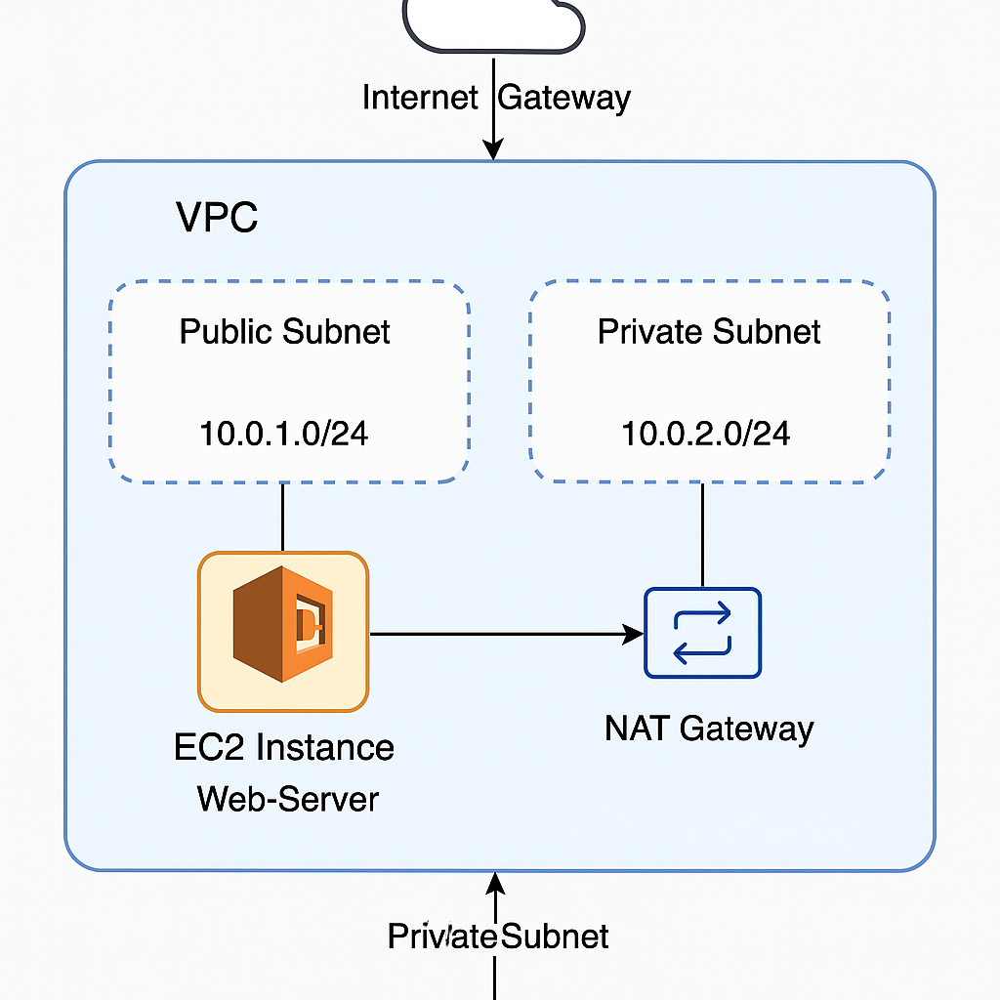

# aws-vpc-networking-manual
# AWS VPC Networking Project (Manual Setup)

This project demonstrates a manual setup of a secure, scalable VPC architecture using the AWS Management Console.

## 📘 Project Summary

- Created a custom VPC with two subnets:
  - **Public Subnet**: Hosts internet-facing EC2 instances
  - **Private Subnet**: Secured internal services
- Enabled internet access via an **Internet Gateway**
- Allowed private subnet to access internet using a **NAT Instance**
- Deployed a **Web Server (EC2 instance)** in the public subnet
- All configurations were done manually using the AWS Console (No Terraform or CLI)

## 🗺️ Architecture Diagram

## 🔐 Key Concepts

- **VPC**: Isolated virtual network in AWS
- **Subnets**: Segmented IP ranges (public for external-facing, private for internal)
- **Routing Tables**: Controlled access between subnets and the internet
- **NAT Instance**: Allowed private subnet to make outbound connections securely

## 📌 Use Case

This project can be adapted for:
- Hosting secure cloud-based applications
- Bug bounty automation platforms
- Red team tooling setups with public-facing control layers and internal logic hidden

## ⚙️ Manual Configuration Summary

(You can add details in `config_details.txt` if needed)

- VPC CIDR: `10.0.0.0/16`
- Public Subnet: `10.0.1.0/24`
- Private Subnet: `10.0.2.0/24`
- Internet Gateway attached
- NAT Instance in Public Subnet
- EC2 Web Server in Public Subnet

## 🧠 Learning Outcome

Built hands-on understanding of:
- Subnet segmentation
- Routing logic
- Secure internet exposure in AWS
- NAT vs. IGW differences
